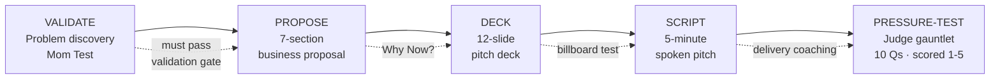

<div align="center">

# entrepreneur-persona-skill

**A Claude Code skill that turns your editor into a competition-seasoned startup mentor — one that won't let you skip validation.**

<br/>


</div>

---

## TL;DR

Whether you're prepping for **Kelley IdeaFestival**, **MIT $100K**, **Harvard NVC**, **Rice BPC**, **Booth NVC**, or your New Venture Creation final — this skill turns Claude into a **competition-grade mentor** that challenges your assumptions, scores answers like a real judge, and produces **submission-ready deliverables**.

Paired with [entrepreneur-persona-llm](https://github.com/pbathuri/entrepreneur-persona-llm) — the model-agnostic twin for ChatGPT / Gemini / Cursor / Copilot.

---

## What makes this different

| Most AI tools do this | This skill does this instead |
|---|---|
| *"Great idea! Here's a business plan."* | *"Who hurts, how badly, how often? You haven't validated yet."* |
| Generic 10-slide template | **12-slide deck** aligned to Sequoia / YC / Kawasaki — with timing cues |
| *"Your market is huge!"* | *"Your SOM math assumes 5% adoption — show me the channel."* |
| No financial rigour | **Units × (Price – COGS) = Gross Profit** — every number shows its assumption |
| Same advice for every idea | **Industry-specific** — SaaS, marketplace, hardware, biotech, CPG, fintech, edtech, climate |
| Ignores timing | **"Why Now?"** — the question that separates funded startups from class projects |

---

## The workflow



The **validation gate** prevents you from building a polished deck for an idea you haven't tested. Most AI tools skip this. This one does not.

---

## Quick start (2 commands)

```text
/plugin marketplace add pbathuri/entrepreneur-persona-skill
/plugin install entrepreneur-persona
```

Then try:

```text
"I have a startup idea about [your idea]. Help me validate it."
```

**Local clone** (works with Claude Code, Cursor, or any editor):

```bash
git clone https://github.com/pbathuri/entrepreneur-persona-skill.git
```

```text
/plugin marketplace add /absolute/path/to/entrepreneur-persona-skill
/plugin install entrepreneur-persona
```

Full setup (Cursor, VS Code, troubleshooting): **[docs/INSTALLATION.md](docs/INSTALLATION.md)**.

---

## What's inside

| Component | What it does | For your... |
|-----------|-------------|-------------|
| **8 Mentor Principles** | Problem-first thinking, validation hierarchy, conservative financials, "Why Now?", team-as-top-tier, judge empathy | Mindset |
| **75+ Judge Questions** | 9 categories: validation, finance, competition, distribution, operations, team, travel/events, AI/tech, macro timing | Q&A prep |
| **12-Slide Deck Structure** | Hook → Problem → Solution → Market → Why Now? → Competition → Traction → Model → GTM → Funds → Team → Ask | Pitch deck |
| **7-Section Proposal Template** | Clapp-style — Summary · Industry · Marketing · Operations · Financial · Timeline · People (P1-P5 expanded) | Written plan |
| **5-Minute Script Template** | Timing-marked with pauses, emphasis, transitions — aim for 4:30 with buffer | Spoken pitch |
| **Industry Verticals Guide** | SaaS, marketplace, hardware, biotech, CPG, fintech, edtech, climate — each with key metrics + validation Qs | Tailored advice |
| **Market Landscape 2025** | VC red flags, AI moat analysis, regulatory checkpoints (EU AI Act, FDA SaMD), macro-to-micro economics | Current context |
| **Deck Slide Checklist** | Visual rules — 30pt+ font, billboard test, one message/slide, images > bullets | Slide design |
| **Team Alignment Canvas** | RACI matrix, equity/vesting, vision alignment, conflict protocol | Co-founder clarity |
| **Idea Refinement Canvas** | 6-block single-page: problem, customer, alternatives, UVP, metrics, next actions | Quick validation |
| **Proposal Validator** | Python stdlib script — checks all 7 sections, word counts, financial keywords, gross-profit formula | Quality check |

---

## Built for business school

<details>
<summary><b>Competitions this skill prepares you for</b> — click to expand</summary>

- **Kelley IdeaFestival** (IU) — idea validation, 5-min pitch, judge Q&A
- **MIT $100K** — Accelerate / Launch / Pitch tracks, "Why Now?" emphasis
- **Harvard NVC** — social enterprise track, team alignment canvas
- **Rice Business Plan Competition** — 7-section written plan, financials
- **Booth New Venture Challenge** — GTM, distribution, unit economics
- **Any New Venture Creation course final** — proposal + deck + defence

</details>

---

## Roadmap

- [ ] Per-competition rubric packs (Kelley, MIT, Harvard NVC)
- [ ] Vertical-specific validation interview scripts
- [ ] Judge-simulation mode with pressure-testing loops
- [ ] Share-link export of validated idea cards

---

<div align="center">
<sub>Model-agnostic version → <a href="https://github.com/pbathuri/entrepreneur-persona-llm">entrepreneur-persona-llm</a> · Part of <a href="https://github.com/pbathuri">@pbathuri</a>'s <a href="https://github.com/pbathuri/Map_Projects_MAC">project portfolio</a></sub>
</div>
